# Frontend Mentor - Coffeeroasters subscription site solution

This is a solution to the [Coffeeroasters subscription site challenge on Frontend Mentor](https://www.frontendmentor.io/challenges/coffeeroasters-subscription-site-5Fc26HVY6). Frontend Mentor challenges help you improve your coding skills by building realistic projects.

## Table of contents

- [Overview](#overview)
  - [The challenge](#the-challenge)
  - [Screenshot](#screenshot)
  - [Links](#links)
- [My process](#my-process)
  - [Built with](#built-with)
  - [What I learned](#what-i-learned)
  - [Continued development](#continued-development)
  - [Useful resources](#useful-resources)
- [Author](#author)
- [Acknowledgments](#acknowledgments)

**Note: Delete this note and update the table of contents based on what sections you keep.**

## Overview

### The challenge

Users should be able to:

- View the optimal layout for each page depending on their device's screen size
- See hover states for all interactive elements throughout the site
- Make selections to create a coffee subscription and see an order summary modal of their choices

### Screenshot

Home Page:
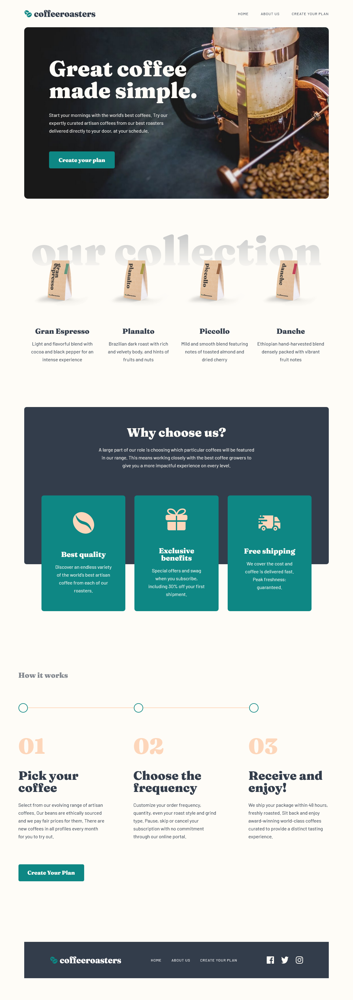
About Page:
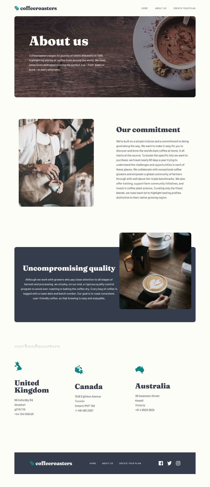
Subscribe Page:
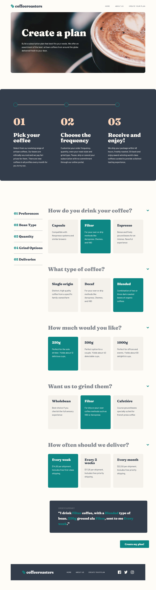
Checkout Modal:
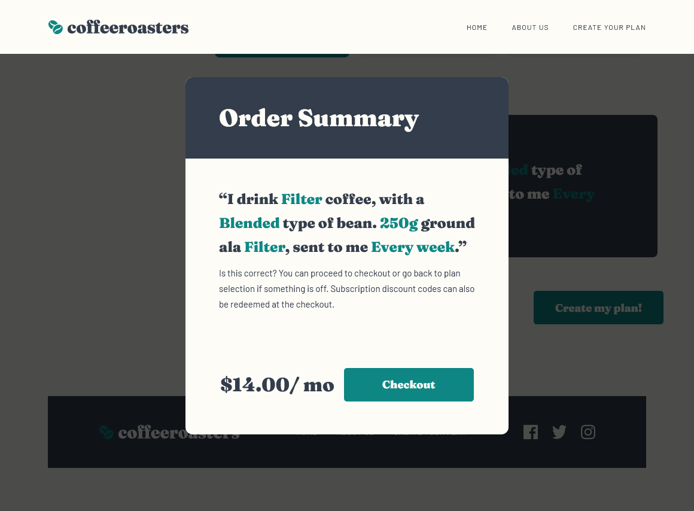

### Links

- Solution URL: [Add solution URL here](https://your-solution-url.com)
- Live Site URL: [Add live site URL here](https://your-live-site-url.com)

## My process

### Built with

- Semantic HTML5 markup
- CSS custom properties
- Flexbox
- CSS Grid
- Mobile-first workflow
- [React](https://reactjs.org/) - JS library
- [Next.js](https://nextjs.org/) - React framework
- [Styled Components](https://styled-components.com/) - For styles

**Note: These are just examples. Delete this note and replace the list above with your own choices**

### What I learned

#### Pseudo Elements

I got to use psuedo elements in this porject which is a skill that i picked up in recent projects that is proving to be super useful. I used them to create backgrounds that where within a parent div but positioned absolute and therefor independant from the rest of the layout of the parent.

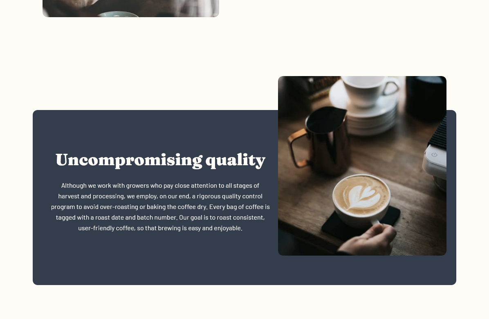

```scss
.quality_container {
	text-align: center;
	padding: 24px;
	margin-top: 120px;
	position: relative;
	color: var(--light-cream-100);

	&::after {
		content: '';
		background-color: var(--dark-greyblue-900);
		position: absolute;
		bottom: 0;
		left: 0;
		right: 0;
		width: 100%;
		height: 80%;
		z-index: -1;
		border-radius: 12px;
	}
	@media (min-width: $media-desktop) {
		display: grid;
		grid-template-columns: 7fr 5fr;
	}
}
```

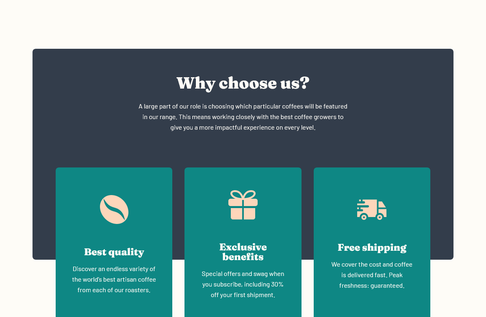

```scss
.why_container {
	position: relative;
	color: var(--light-cream-100);
	text-align: center;
	padding: 0 24px;
	h2 {
		font-size: var(--md-header-fs);
		margin-bottom: 24px;
	}
	p {
		font-size: var(--md-body-fs);
		max-width: 516px;
	}

	&::after {
		content: '';
		background-color: var(--dark-greyblue-900);
		position: absolute;
		height: 59%;
		width: 100%;
		top: 0;
		left: 0;
		right: 0;
		z-index: -1;
		border-radius: 8px;
		@media (min-width: $media-tablet) {
			height: 65%;
		}
		@media (min-width: $media-desktop) {
			height: 77%;
		}
	}
	@media (min-width: $media-tablet) {
		padding: 0 57px;
	}
}
```

#### Component with Dynamic Backgorund using classes

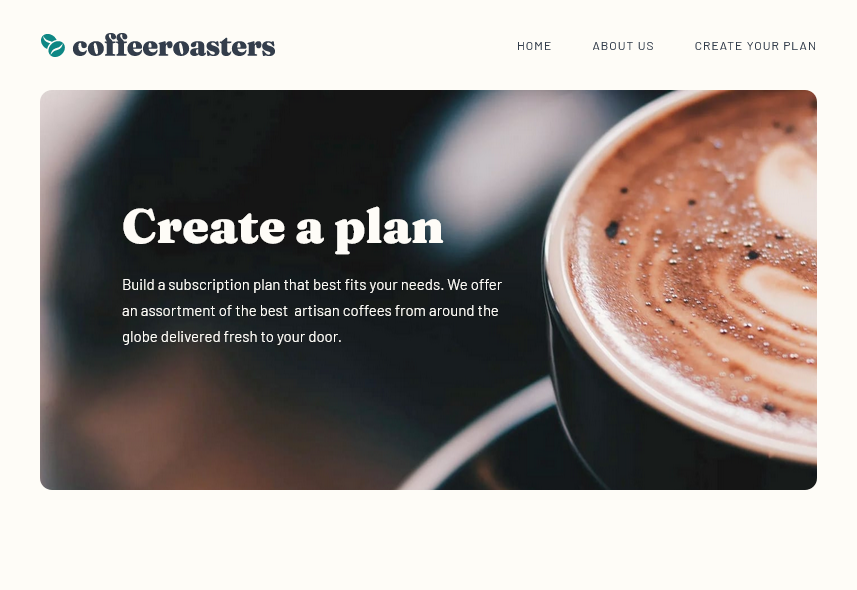
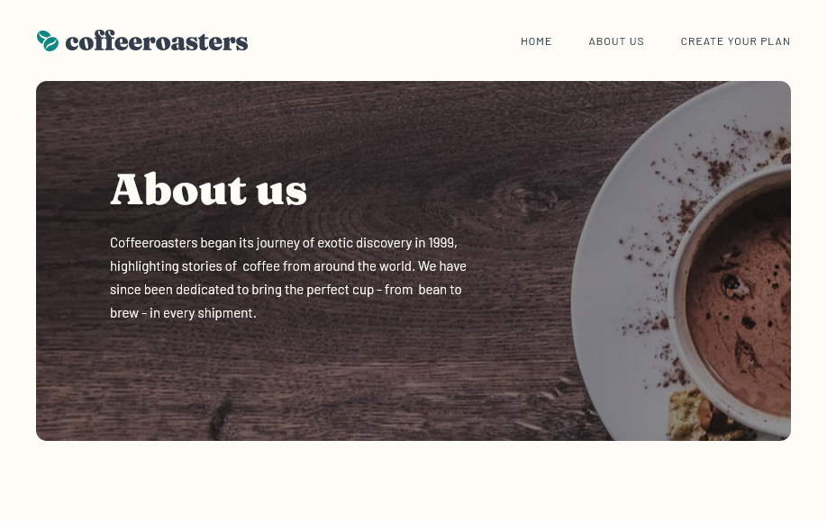

There is a hero section that is at the top of the about page and subscribe page that I wanted to be identical but with a different title, text and background image. The title and text could be passed as strings to my hero component but the background image was going to come from a different source based on the viewport screen size. I went down a few paths to do this that were not going to work. If i passed all images for different breakpoints to the component i could set one of the images to be the the background image but i could not add media queries for the others dynamically using inline styles without using a library like `styled-components`.

Then i found a solution that worked for my case. I set up a css class that would change the backgroung image based on media queries. I styled the rest of the component with its own styles and then the class with the backgorund images was addes dynamically to the component and it worked.

```scss
.white-cup-image {
	background-image: url(../public/assets/about/mobile/image-hero-whitecup.jpg);
	@media (min-width: $media-tablet) {
		background-image: url(../public/assets/about/tablet/image-hero-whitecup.jpg);
	}
	@media (min-width: $media-desktop) {
		background-image: url(../public/assets/about/desktop/image-hero-whitecup.jpg);
	}
}
```

```tsx
<HeroCard
	description='Coffeeroasters began its journey of exotic discovery in 1999, highlighting stories of 
	coffee from around the world. We have since been dedicated to bring the perfect cup - from 
	bean to brew - in every shipment.'
	title='About us'
	imageClassName='white-cup-image'
></HeroCard>
```

#### Text header postion absolute

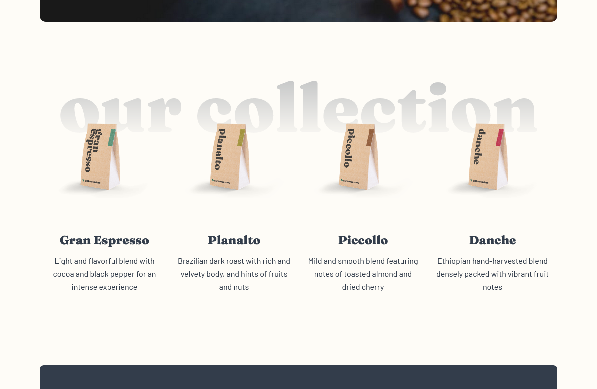

I used postion absolute on the header in the `what container` on the `home page`. Changing the parent container to relative and using the top, left, right, bottom properties allows you to place the header anywhere in its parent without its layout affecting anything else because it is on a different plane or layer than the other elements. In this project i used posion top and a negative value that was about half the width of the header to give the apperance that the header was behind the container and centered vertically on the top of the container.

```scss
.what_container {
	position: relative;
	margin-bottom: 120px;
	margin-top: 120px;
	h2 {
		font-size: var(--xl-header-fs);
	}
	@media (min-width: $media-tablet) {
		margin-top: 203px;
		h2 {
			font-size: 96px;
			z-index: -1;
			display: block;
			position: absolute;
			left: 0;
			right: 0;
			top: -70px;
		}
	}
	@media (min-width: $media-desktop) {
		h2 {
			font-size: 135px;
			top: -100px;
		}
	}
}
```

See what container in Reusable components for the markup for `what_container`

#### Resused Components

Everywhere that i was using the same cards multiple times i broke apart the code into its own code to its own components. Then if i wanted to make a change to the markup or styles for the card i only need to make the change once and it will be reflected in all instances of the component.

```tsx
{
	/* WHAT Section */
}
;<section className={styles.what_container}>
	<h2 className='alternate-title'>Our collection</h2>
	<div className={styles.what_card_container}>
		<WhatCard
			imageURL='/assets/home/desktop/image-gran-espresso.png'
			title='Gran Espresso'
			description='Light and flavorful blend with cocoa and black pepper for an intense experience'
			altText='gran espresso beans'
		></WhatCard>
		<WhatCard
			imageURL='/assets/home/desktop/image-planalto.png'
			title='Planalto'
			description='Brazilian dark roast with rich and velvety body, and hints of fruits and nuts'
			altText='planalto beans'
		></WhatCard>
		<WhatCard
			imageURL='/assets/home/desktop/image-piccollo.png'
			title='Piccollo'
			description='Mild and smooth blend featuring notes of toasted almond and dried cherry'
			altText='piccollo beans'
		></WhatCard>
		<WhatCard
			imageURL='/assets/home/desktop/image-danche.png'
			title='Danche'
			description='Ethiopian hand-harvested blend densely packed with vibrant fruit notes'
			altText='danche beans'
		></WhatCard>
	</div>
</section>
```

```tsx
{
	/* WHAT Card */
}
export const WhatCard: React.FC<WhatCardProps> = ({ imageURL, title, description, altText }) => {
	return (
		<div className={styles.container}>
			
			<div className={styles.textcontent}>
				<h3>{title}</h3>
				<p>{description}</p>
			</div>
		</div>
	)
}
```

#### Custom Modal no-scroll

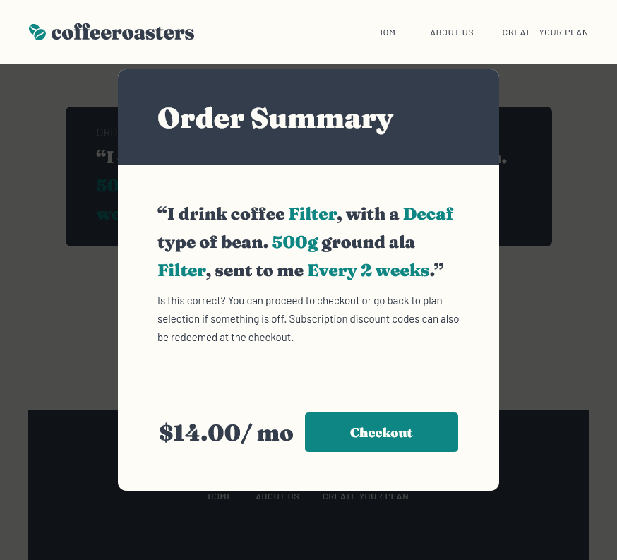

I built custom modals for the checkout modal and for the mobile-menu. The modals were both controlled by a peice of state that would not display the component if it was false, the default, and would show the component if it was true. The modals also keep you from scrolling through the body while they are open and allow you to close them by clicking the overlay behind them. These are the steps to make the modal:

- The overlay takes over the screen using a postion fixed and full width and height.
- The modal is created as a component within the overlay div.

```tsx
{
	modal && (
		<div id='overlay' className={styles.modal_page_container} onClick={overlay_click_listener}>
			<div className={styles.modal_container}>
				<div className={styles.modal_header}>
					<h2>Order Summary</h2>
				</div>
				<div className={styles.modal_content}>
					<p className={styles.modal_plan}>
						“I drink <span>{q1 ? q1 : '______'}</span> coffee, with a{' '}
						<span>{q2 ? q2 : '______'}</span> type of bean. <span>{q3 ? q3 : '______'}</span> ground
						ala <span>{q4 ? q4 : '______'}</span>, sent to me <span>{q5 ? q5 : '______'}</span>.”
					</p>
					<p className={styles.modal_details}>
						Is this correct? You can proceed to checkout or go back to plan selection if something
						is off. Subscription discount codes can also be redeemed at the checkout.{' '}
					</p>
					<div className={`${styles.modal_checkout}`}>
						<p>$14.00/ mo</p>
						<button className='button-primary'>Checkout</button>
					</div>
					<button className='button-primary mobileOnly'>Checkout - $14.00/ mo</button>
				</div>
			</div>
		</div>
	)
}
```

- To stop the scroll in the background we add `document.body.style.position = 'fixed'`.
- In order to keep our postion on the page we add `document.body.style.top = `-${window.scrollY}px``.

```ts
const showModal = () => {
	toggleModal(true)
	document.body.style.top = `-${window.scrollY}px`
	document.body.style.position = 'fixed'
	document.body.style.width = '100vw'
}

- When we close out of the modal we change the postion and top values back to their default and then scroll to the postion that we were at origially using `window.scrollTo(0, parseInt(scrollY || '0') * -1)`.

const closeModal = () => {
	const body = document.body
	const scrollY = body.style.top
	body.style.position = ''
	body.style.top = ''
	window.scrollTo(0, parseInt(scrollY || '0') * -1)
	toggleModal(false)
}
```

- The event listener is on the entire overlay parent div and listens for a click which has a target with the matching 'overlay' id which in out project is just the overlay parent.

```tsx
const overlay_click_listener: React.MouseEventHandler<HTMLDivElement> = (e) => {
	console.log('clicked', e.target)

	//if the current target is the overlay close the modal
	if (e.target.id === 'overlay') {
		closeModal()
	}
}
```

#### Page State

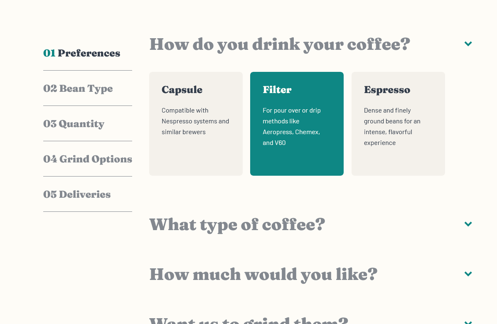


Page State is used on the subscribe page to keep track of the responses to the questions as well as a piece of state to track if the checkout modal is being displayed. The state is used by the following components.

State:

```tsx
const [q1, setQ1] = useState('')
const [q2, setQ2] = useState('')
const [q3, setQ3] = useState('')
const [q4, setQ4] = useState('')
const [q5, setQ5] = useState('')

const [modal, toggleModal] = useState(false)
```

Used in the aside menu to show the 'li-selected' class only if the response has been changed from the default.

```tsx
<aside className={styles.options_menu}>
	<ul>
		<li className={q1 === '' ? '' : 'li-selected'}>
			<span>01</span> Preferences
		</li>
		<li className={q2 === '' ? '' : 'li-selected'}>
			<span>02</span> Bean Type
		</li>
		<li className={q3 === '' ? '' : 'li-selected'}>
			<span>03</span> Quantity
		</li>
		<li className={q4 === '' ? '' : 'li-selected'}>
			<span>04</span> Grind Options
		</li>
		<li className={q5 === '' ? '' : 'li-selected'}>
			<span>05</span> Deliveries
		</li>
	</ul>
</aside>
```

Used to pass the current response to the Options component so it can use a selected class to adjust its selected childs appearance. The options component also takes a setter function to change the state of the subscribe page.

```tsx
<Options
	question='How do you drink your coffee?'
	options={questions[0]}
	setSelected={setQ1}
	selected={q1}
></Options>
<Options
	setSelected={setQ2}
	selected={q2}
	question='What type of coffee?'
	options={questions[1]}
></Options>
<Options
	setSelected={setQ3}
	selected={q3}
	question='How much would you like?'
	options={questions[2]}
></Options>
<Options
	setSelected={setQ4}
	selected={q4}
	question='Want us to grind them?'
	options={questions[3]}
></Options>
<Options
	setSelected={setQ5}
	selected={q5}
	question='How often should we deliver?'
	options={questions[4]}
></Options>
```

Used in the summary to show the currently selected responses or a blank if the default state is still present.

```tsx
<div className={styles.summary_container}>
	<h2>Order Summary</h2>
	<p>
		“I drink
		<span className={styles.textHighlight}>{q1 ? q1 : '______'}</span> coffee, with a <span
			className={styles.textHighlight}
		>
			{q2 ? q2 : '______'}
		</span> type of bean. <span className={styles.textHighlight}>{q3 ? q3 : '______'}</span> ground ala{' '}
		<span className={styles.textHighlight}>{q4 ? q4 : '______'}</span>, sent to me <span
			className={styles.textHighlight}
		>
			{q5 ? q5 : '______'}
		</span>.”
	</p>
</div>
```

Used in the button to disable the button if any of the questions still has default state

```tsx
<button
	disabled={q1 === '' || q2 === '' || q3 === '' || q4 === '' || q5 === ''}
	className='button-primary'
	onClick={showModal}
>
	Create my plan!
</button>
```

### Question Dropdown - Component State

I used a piece of state within the options component to determine wether the dropdown was displayed or not. The stae is set to false by default but when anywhere within the question container is clicked the dropdown toggles to the opposite of the current state. The useEffect is used one time when the page is first loaded to open the modal of the first question.

```tsx
export const Options: React.FC<OptionsProps> = ({ question, options, selected, setSelected }) => {
	const [modalToggle, setModalToggle] = useState(false)

	// on initial page load open the first question
	useEffect(() => {
		if (question === 'How do you drink your coffee?') {
			setModalToggle(true)
		}
	}, [])

	return (
		<div className={styles.container}>
			<div className={styles.question_container} onClick={() => setModalToggle(!modalToggle)}>
				<h4>{question}</h4>
				<ArrowIcon></ArrowIcon>
			</div>

			{modalToggle && (
				<div className={styles.options_container}>
					{options.map((option) => (
						<Option
							setSelected={setSelected}
							key={option.value}
							option={option}
							selected={selected === option.value}
						></Option>
					))}
				</div>
			)}
		</div>
	)
}
```

#### Sass Mixins and Variables

I used a Mixin for flex-column-center because i was using these same properties in a lot of places and it helped me reduce lines of code and readability. I also used variables for colors, font-sizes, screen breakpoints, and page margins. Page margins and font-sizes i scaled up within media queries in the :root selector.

```scss
@mixin flex-column-center {
	display: flex;
	justify-content: center;
	align-items: center;
	flex-direction: column;
}
```

```scss
:root {
	--dark-greyblue-900: #333d4b;
	--dark-cyan-600: #0e8784;
	--medium-grey-400: #83888f;
	--light-orange-200: #fdd6ba;
	--light-cream-100: #fefcf7;

	//headings
	--xl-header-fs: 40px;
	--md-header-fs: 28px;
	--xs-header-fs: 24px;

	//body
	--lg-body-fs: 16px;
	--md-body-fs: 15px;
	--sm-link-fs: 12px;

	//margin and containers
	--page-margin: 24px;
	--page-container: 1200px;

	//media queris
	--media-tablet: 768px;
	--media-desktop: 1140px;

	@media (min-width: $media-tablet) {
		--xl-header-fs: 48px;
		--md-header-fs: 32px;
		--xs-header-fs: 24px;
		--page-margin: 40px;
	}

	@media (min-width: $media-desktop) {
		--xl-header-fs: 72px;
		--md-header-fs: 40px;
		--md-body-fs: 16px;
		--page-margin: 80px;
	}
}
```

### Continued development

### Useful resources

- [CSS Text ](https://fossheim.io/writing/posts/css-text-gradient/) - This helped me with clipping a gradient to text like a header.
- [CSS Tricks](https://css-tricks.com/prevent-page-scrolling-when-a-modal-is-open/) - This helped me stop the background scrolling when a modal is open.

## Author

- Website - [Joey Desjardin](https://www.joeydesjardin.com)
- Frontend Mentor - [@yourusername](https://www.frontendmentor.io/profile/jwdesjardin)
